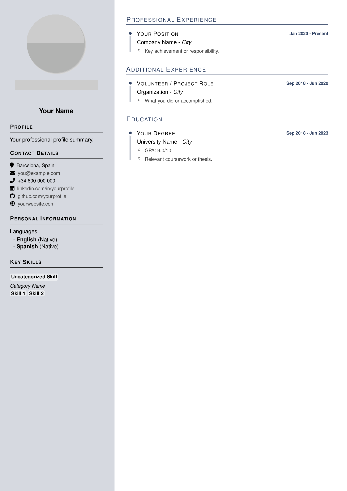
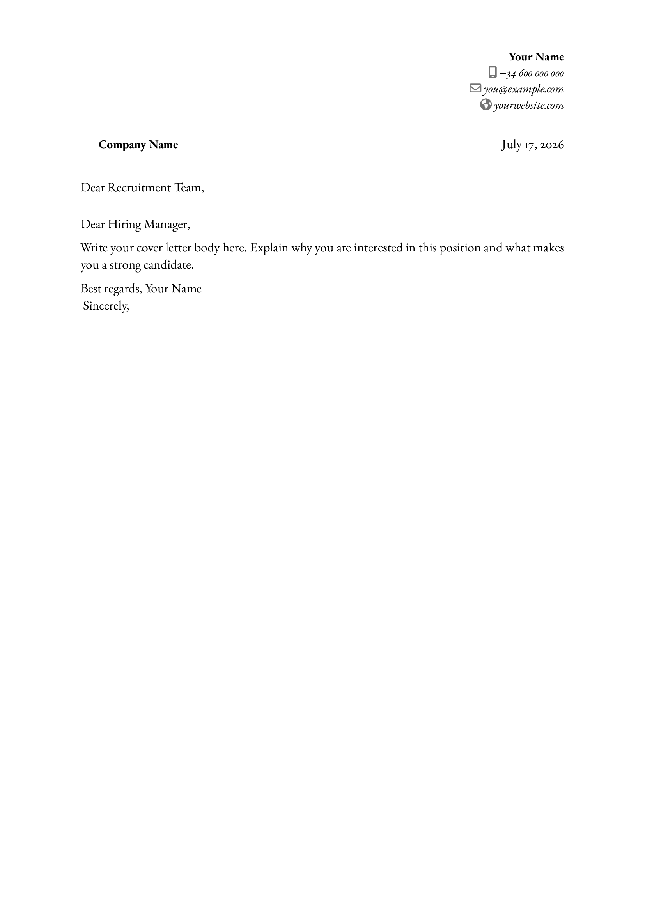

# cv-cli

A CLI tool for building multi-language CVs and cover letters from YAML content files using Pandoc and LaTeX.

### Generated Templates

| CV | Cover Letter |
|---|---|
|  |  |

## Prerequisites

- Pandoc
- LaTeX (TeX Live or similar)
- Python 3.7+

## Installation

```bash
pip install --user -e .
```

## Usage

```bash
cv init               # Initialize a new project with default templates
cv cv -l en           # Create a new English CV
cv letter acme -l es  # Create a new Spanish cover letter for the company "acme"
cv template cv        # Open the CV LaTeX template in $EDITOR
cv build              # Build all CVs and letters
cv build -t cv -l en  # Build only English CVs
cv clean              # Clean all generated files
```

## Project structure

```
letters/
  template-en.yaml
  acme-es.yaml          # One file per company-language
  <company>-<lang>.yaml
cv-en.yaml
cv-<lang>.yaml
photo.png
signature.png
```
